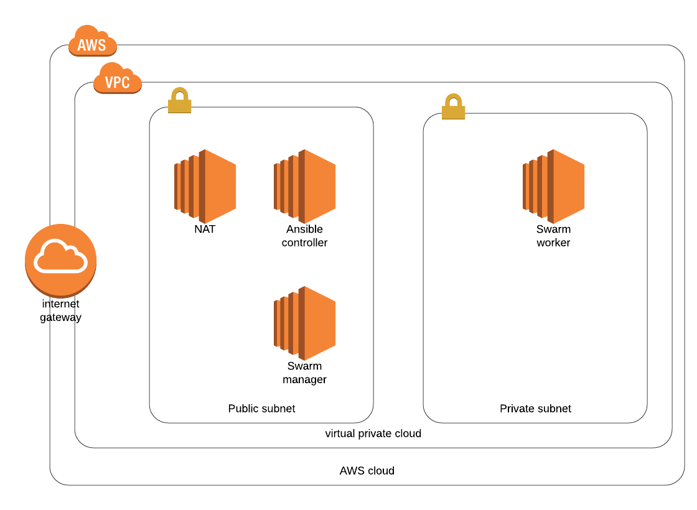

# Code challenge 

1) Linting dei sorgenti YAML

> Linting dei file YAML tramite `yamllint` e `ansible-lint`.

2) Deployment dello stack `network` tramite ansible su AWS.

> Lo stack `network` è composto da 2 subnet, 1 pubblica ed una privata. All'interno della subnet pubblica è presente un'instance EC2 con funzionalità di NAT Gateway.
    
3) Deployment dello stack `ec2` tramite ansible su AWS.

> Lo stack `ec2` è composto da tre istanze EC2 cone le seguenti funzionalità: un ansible controller, un docker swarm manager e un docker swarm worker. L'ansible controller permette di configurare gli altri nodi tramite ansible. L'ansible controller e lo swarm manager sono inseriti all'interno della subnet pubblica mentre lo swarm worker nella subnet privata. Entrame le istanze docker sono accessibili tramite SSH unicamente dalla VPC di AWS.

4) Configurazione dei nodi docker `ec2` tramite il nodo `ansible-controller` deployato allo step precendete.

> Il primo nodo da configurare è l'ansible controller. Successivamente ci si collega tramite SSH al nodo e si configurano i due nodi docker, installando e avviando lo swarm.

> :warning: Per effettuare il deployment delle risorse AWS da Travis bisogna impostare le variabili d'ambiente per l'autenticazione.